# 📘 Phase I & Phase II – Visitor Entry Management System  
### *Complete MIS Documentation (Markdown Version)*  

---

# 📘 **Phase I: System Analysis & Requirements (MIS)**  

## 🔍 **Scope & Purpose**  
The Visitor Entry Management System is designed to replace traditional **manual logbooks** with an automated MIS solution.  
Its purpose is to streamline registration, strengthen security, and ensure accurate, real-time access to visitor data.

This phase identifies:  
- The stakeholders  
- The system requirements  
- The business problems  
- MIS contributions  

---

## 👥 **Key Actors**

| Actor / Role             | Responsibility |
|--------------------------|----------------|
| **Security Officer**     | Verifies visitor ID, records entry & exit |
| **Receptionist**         | Confirms host employee & prints visitor pass |
| **Host Employee**        | Receives automatic alerts when visitor arrives |
| **Visitor**              | Provides identification & purpose |
| **MIS System**           | Logs entry/exit, stores data, performs analytics |
| **Admin/System User**    | Manages staff, user accounts, and system settings |

---

## 🧩 **Core Problem Identified**
Organizations using manual logbooks suffer from:

- Time-consuming visitor registration  
- Human errors and incomplete entries  
- Loss of historical records  
- Poor security tracking  
- No instant way to know who is inside  
- No analytics for decision-making  

### ✔ How MIS Solves These Problems
- Automated entry & exit logging  
- PL/SQL triggers update records instantly  
- Real-time monitoring of visitors inside  
- Automatic host notifications  
- Enhanced security through ID/QR verification  
- Data analytics reports (peak hours, visited departments)

---

## 🧠 **MIS Contribution Summary**

The MIS enhances the organization through:

- **Real-time decision-making**  
- **Secure data storage with integrity**  
- **Accurate automated processes**  
- **Improved security compliance**  
- **Analytical insights for managers**  
- **Elimination of redundant manual work**  

---

# 📘 **Phase II: Business Process Modeling (MIS)**  

## 🔍 **Scope & Purpose**  
This phase models the workflow of how a visitor is managed from arrival to exit, showing how the MIS automates and supports each step.

It covers:  
- Process flow  
- Business workflow logic  
- MIS automation points  
- Manual + automated tasks interaction  

---

# 👥 **Actors Involved**

| Role                    | Responsibility |
|-------------------------|----------------|
| **Visitor**             | Arrives and provides ID |
| **Security Officer**    | Verifies ID and registers details |
| **Receptionist**        | Contacts host & prints pass |
| **Host Employee**       | Receives visitor notifications |
| **MIS System**          | Logs entry/exit via PL/SQL triggers |
| **Alert System**        | Sends host notifications |

---

# 🖼️ **Mermaid Process Diagram**

> ⚠ You can render this in VS Code using the Mermaid extension.

```mermaid
flowchart TD
  start([● Process Start]) --> V1["🧍 Visitor Arrives at Gate"]
  V1 --> S1["🛂 Security Officer Verifies ID"]
  S1 --> S2["📝 Record Visitor Details"]
  S2 --> R1["📞 Reception Confirms Host Employee"]
  R1 --> H1["👤 Host Employee Notified"]
  H1 --> R2["🎟️ Generate & Issue Visitor Pass"]
  R2 --> MIS1["💾 MIS Logs Entry (PL/SQL Trigger Executes)"]
  MIS1 --> D1{{"🔍 Visitor Inside Premises?"}}

  D1 -- Yes --> V2["⏱ Visitor Proceeds to Visit"]
  V2 --> V3["🚪 Visitor Exits"]
  V3 --> MIS2["💾 MIS Logs Exit (Trigger Updates Status)"]
  MIS2 --> finish([✅ Process End])

  D1 -- No --> finish

  classDef visitor fill:#9cf,stroke:#333;
  classDef security fill:#f9f,stroke:#333;
  classDef recep fill:#bbf,stroke:#333;
  classDef host fill:#9f9,stroke:#333;
  classDef system fill:#f96,stroke:#333;

  class V1,V2,V3 visitor
  class S1,S2 security
  class R1,R2 recep
  class H1 host
  class MIS1,MIS2,D1 system
```


# 🧩 Phase III: Logical Model Design — Visitor Entry Management System

## 🎯 Objective

This phase focuses on designing the **logical database model** for the Visitor Entry Management System.  
The model is derived from the real operational needs identified in Phase I and the workflow defined in Phase II.  

The goal is to build a **normalized, constraint-driven relational structure** that manages visitors, staff, visits, system users, verification processes, alerts, and historical logs of entries/exits.

---

# 🗃️ Entities & Attributes

## 🧍 Visitors

| Attribute       | Type            | Constraint                                         |
|-----------------|-----------------|---------------------------------------------------|
| Visitor_ID      | NUMBER          | Primary Key (Auto-generated)                      |
| Full_Name       | VARCHAR(150)    | NOT NULL                                          |
| Gender          | VARCHAR(20)     | CHECK (gender IN ('Male','Female','Other'))       |
| ID_Number       | VARCHAR(50)     | NOT NULL, UNIQUE                                  |
| Contact_Info    | VARCHAR(100)    | NULL allowed                                      |
| Created_At      | DATE            | DEFAULT SYSDATE                                   |

---

## 👨‍💼 Staff

| Attribute       | Type            | Constraint                                         |
|-----------------|-----------------|---------------------------------------------------|
| Staff_ID        | NUMBER          | Primary Key (Auto-generated)                      |
| Staff_Name      | VARCHAR(150)    | NOT NULL                                          |
| Department      | VARCHAR(100)    | NOT NULL                                          |
| Position        | VARCHAR(100)    | NULL allowed                                      |
| Contact_Info    | VARCHAR(100)    | NULL allowed                                      |

---

## 🚪 Visit_Log

| Attribute        | Type            | Constraint                                          |
|------------------|-----------------|------------------------------------------------------|
| Log_ID           | NUMBER          | Primary Key (Auto-generated)                        |
| Visitor_ID       | NUMBER          | Foreign Key → Visitors                              |
| Staff_ID         | NUMBER          | Foreign Key → Staff                                 |
| Purpose          | VARCHAR(500)    | NULL allowed                                        |
| Entry_Time       | DATE            | DEFAULT SYSDATE                                     |
| Exit_Time        | DATE            | NULL allowed (updated automatically on checkout)    |
| Status           | VARCHAR(30)     | CHECK (IN ('Entered','Exited','Pending'))           |
| Pass_Number      | VARCHAR(50)     | UNIQUE, NOT NULL                                    |

---

## 👤 System_Users

| Attribute       | Type            | Constraint                                         |
|-----------------|-----------------|---------------------------------------------------|
| User_ID         | NUMBER          | Primary Key (Auto-generated)                      |
| Username        | VARCHAR(100)    | UNIQUE, NOT NULL                                  |
| Password_Hash   | VARCHAR(200)    | NOT NULL                                          |
| Role            | VARCHAR(50)     | CHECK (IN ('Admin','Security','Reception'))       |
| Created_At      | DATE            | DEFAULT SYSDATE                                   |

---

## 📝 Verification_Log

| Attribute        | Type            | Constraint                                        |
|------------------|-----------------|--------------------------------------------------|
| Verif_ID         | NUMBER          | Primary Key (Auto-generated)                     |
| Visitor_ID       | NUMBER          | Foreign Key → Visitors                           |
| Verified_By      | NUMBER          | Foreign Key → System_Users                       |
| Verification_Time| DATE            | DEFAULT SYSDATE                                  |
| Verification_Type| VARCHAR(50)     | CHECK (IN ('ID Check','QR Scan','Manual Entry')) |
| Note             | VARCHAR(500)    | NULL allowed                                     |

---

## ⚠ Alert_Log

| Attribute       | Type            | Constraint                                          |
|-----------------|-----------------|------------------------------------------------------|
| Alert_ID        | NUMBER          | Primary Key (Auto-generated)                        |
| Visitor_ID      | NUMBER          | Foreign Key → Visitors                              |
| Staff_ID        | NUMBER          | Foreign Key → Staff                                 |
| Alert_Message   | VARCHAR(2000)   | NOT NULL                                            |
| Severity        | VARCHAR(20)     | CHECK (IN ('Low','Medium','High'))                 |
| Alert_Time      | DATE            | DEFAULT SYSDATE                                     |

---

## 🗂 Status_Log

| Attribute       | Type            | Constraint                                           |
|-----------------|-----------------|-----------------------------------------------------|
| StatusLog_ID    | NUMBER          | Primary Key (Auto-generated)                        |
| Visitor_ID      | NUMBER          | Foreign Key → Visitors                               |
| Old_Status      | VARCHAR(30)     | NULL allowed                                        |
| New_Status      | VARCHAR(30)     | NOT NULL                                            |
| Updated_At      | DATE            | DEFAULT SYSDATE                                     |
| Note            | VARCHAR(500)    | NULL allowed                                        |

---

# 🔄 Relationships & Constraints

- **Visitors → Visit Logs** — One visitor can have many visit entries (1:N)  
- **Staff → Visit Logs** — One staff member can host many visitors (1:N)  
- **Visitor → Verification Logs** — Each visitor can undergo multiple checks (1:N)  
- **Visitor → Alert Logs** — Alerts can be generated per visitor (1:N)  
- **System Users → Verification Logs** — Verification is always tied to a user (1:N)  
- **Visitor → Status Logs** — Each status change is logged historically (1:N)  

### ✔ Data Integrity Ensured Through:
- Foreign key constraints  
- CHECK constraints on status, role, severity  
- DEFAULT values for timestamps  
- UNIQUE constraints on ID numbers and pass numbers  
- Auto-generated primary keys via sequences  

---

# 📐 Normalization (3NF Compliance)

### ✔ 1NF  
- All data is atomic  
- Each field contains a single value  

### ✔ 2NF  
- No partial dependencies  
- Non-key attributes fully depend on primary keys  

### ✔ 3NF  
- No transitive dependencies  
- Example: Visitor contact details are stored only in `Visitors`, not in Visit_Log  
- Alerts depend only on a single visitor and staff pair, not other entities  

---

# 🖼️ ERD Diagram (Placeholder)

> 🟧 **Visual Placeholder: Logical Model ERD**  
> Replace these placeholders with your own screenshots in VS Code.


---

# ✅ End of Phase III (Logical Model Design)
``
# 🏗️ Phase IV: Database Creation and Access Setup (via SQL Developer)

## 🎯 Objective

To set up and configure a dedicated Oracle **PL/SQL environment** for the *Visitor Entry Management System*.  
SQL Developer is used as the primary administrative tool (alternative to Oracle Enterprise Manager) to create a secure workspace where all visitor, staff, logs, alerts, and verification data will be stored in an isolated and well-managed pluggable database (PDB).

This environment prepares the foundation for **Phase V**, where physical tables, triggers, sequences, and procedures will be implemented.

---

## 🔐 Task 1: PDB and User Creation (SQL Developer)

A **separate Pluggable Database (PDB)** was created to isolate visitor-tracking transactions and allow controlled access, stronger security, and easier schema deployment.

Using SQL Developer’s GUI and the built-in SQL Worksheet, the following were configured:

---

## 🧰 Configuration Summary

| Component                | Value                                                   |
|--------------------------|---------------------------------------------------------|
| **Tool Used**            | SQL Developer (OEM Alternative)                         |
| **PDB Name**             | `wed_28057_Molly_Visitor_PDB`                            |
| **User Created**         | `molly28057`                                            |
| **Password**             | `molly`                                                 |
| **Privileges Granted**   | Basic connect/resource + elevated table-creation rights |

---

## 📸 Screenshot: PDB Connection and Setup

> 🖇️ *Placeholder — replace with your actual screenshot*
>
> 

---

## 📸 Screenshot: User Creation and Assigned Permissions

> 🏛️ *Placeholder — replace with your real screenshot*
>
> 

---

## 💻 SQL Commands Executed


``
# 🧱 Phase V: Table Implementation and Data Insertion

## 🎯 Objective

To physically implement the database structure designed in Phase III and populate it with realistic sample data.  
This enables validation of entity relationships, visitor workflows, entry/exit logs, verification processes, and alert automation in later PL/SQL phases.

---

# 🔨 Step 1: Table Creation

✅ The following tables were created inside the schema:

**`wed_28057_Molly_Visitor_PDB` → user: `molly28057`**  
using SQL Developer.

---

## 🧱 Table: Visitors


---

## 🧱 Table: Staff


---

## 🧱 Table: Visit_Log


---

## 🧱 Table: System_Users


---

## 🧱 Table: Verification_Log


---

## 🧱 Table: Alert_Log


---

## 🧱 Table: Status_Log


---

# 📥 Step 2: Data Insertion

Realistic visitor, staff, and system activity data were inserted to simulate the daily operations of a real organization.

---

## 🗃️ Insertion: Visitors


---

## 🗃️ Insertion: Staff


---

## 🗃️ Insertion: Visit_Log


---

## 🗃️ Insertion: System_Users


---

## 🗃️ Insertion: Verification_Log


---

## 🗃️ Insertion: Alert_Log


---

## 🗃️ Insertion: Status_Log


---

# 🧩 Result

The Visitor Entry Management Database is now:

- Fully created  
- Structured using normalized relational tables  
- Populated with realistic test data  
- Ready for Phase VI (Triggers, Procedures & PL/SQL Automation)

This completes **Phase V**.

``
# 🔧 Phase VI: PL/SQL Programming & Database Interaction

## 🎯 Objective
Phase VI focuses on implementing the **business logic** of the Visitor Entry Management System using PL/SQL.  
The goal is to automate:

- Visitor entry and exit processing  
- Host alert generation  
- Verification logging  
- Status updates  
- Trigger-based activity tracking  
- Analytical reporting (peak visits, frequent visitors, staff load)  
- Modular, package-based operations  

This phase transforms the system from a static database into a **fully automated and intelligent MIS**.

---

# 🧱 Database Operations

## 🔁 DML Operations
Data manipulation was performed to validate the system’s workflows:

- Registering new visitors  
- Recording staff information  
- Logging entry and exit events  
- Creating verification entries  
- Inserting alerts and status changes  

These operations simulate real-world visitor flow in an organization.


---

## 🧩 DDL Operations
DDL operations helped prepare the schema for advanced automation:

- Adding new fields to support triggers  
- Creating sequences for auto-generated IDs  
- Defining constraints (UNIQUE, CHECK, FK)  
- Structuring tables for package-based logic  


---

# 💡 Simple Analytics Problem Statement

> **“Analyze the number of visitors each staff member handles per day using analytic (window) functions.”**

This analysis supports workload balancing and operational planning.


---

# 🛠️ PL/SQL Components

## ✅ Procedure: `register_visitor_entry`
This procedure automates the following:

- Creation of a new visit log  
- Verification of visitor identity  
- Assignment of a unique pass number  
- Automatic notification sent to the host staff  
- Status update to *Entered*  


---

## 🧵 Cursor Integration
Cursors were used to retrieve:

- All visitors currently inside the premises  
- Staff members with the highest visitor load  
- Visitors pending exit updates  

This supports activity reporting and real-time monitoring.


---

# 🧪 Testing
All PL/SQL components—procedures, functions, triggers, and package modules—were thoroughly tested using anonymous execution blocks.

---

## ✅ Function Testing: `get_daily_staff_visitors`
This function returns the **total number of visitors handled** by a given staff member on a specific date.


---

## 🚨 Trigger Testing: Visitor Activity Logging
A trigger was created to automatically:

- Insert log entries when a visitor checks in  
- Update status when they check out  
- Track all changes in the Status_Log table  


---

# 📦 PL/SQL Package: `visitor_mgmt_pkg`
This package organizes the core business operations of the system, including:

- Visitor entry registration  
- Visitor exit processing  
- Alert generation  
- Verification logging  
- Daily analytical reports (via cursors and functions)

### ⭐ Benefits:
- Improved code organization  
- Reusable visitor-management operations  
- Cleaner structure for future system expansion  


---

## 🧪 Package Testing
The package procedures and functions were executed through anonymous PL/SQL blocks to verify:

- Correct logging of visitor entries and exits  
- Proper generation of notifications  
- Accurate analytics output  


---

This phase made the Visitor Entry Management System **smart, automated, and operationally efficient**, enabling real-time monitoring, accurate tracking, and improved workflow intelligence.

```
# 28057_FINAl_EXAM_capstone-

